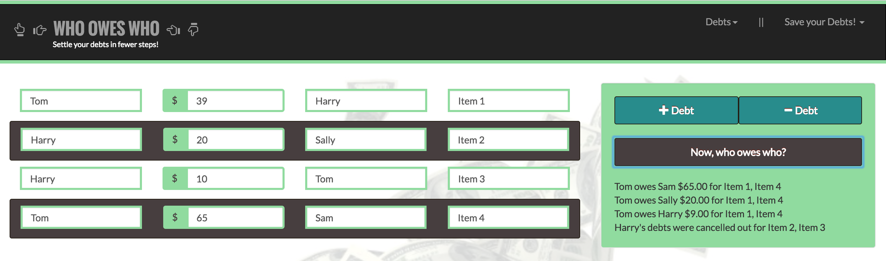

# who_owes_who
A program that totals a list of people's debts to each other and calculates who gets what. 

<a href="https://youtu.be/Bcm9pTK_Kx8">Click me to see video example</a>  

Who Owes Who is a circular debt calculator. If a group of people list all the debts owed to each other, it consolidates them into the fewest transactions possible. In the case below, Harry doesn’t have to pay anything because his debts are cancelled out from what he is owed. 

  

Using JavaScript and jQuery in formula.js, the formula follows these steps: 
1) Create empty arrays of who owes and who gets. For who owes, this includes who from, the debt and for what. For who gets, this includes to whom, the debt and for what. 
2) Establish first debt fields and debt field counting 
3) User adds or removes as many debts that are needed. 
4) Clear the owes and gets arrays. 
5) User inputs all required fields and selects “Now, who owes who?” 
6) The formula when submitted runs as follows: 
	a. combine people and debts for those that owe money who have the same names. 
	b. combine people and debts for those that receive money who have the same names. 
	c. add or subtract debts for those that owe and receive money. 
	d. sort the owes and gets arrays by largest debt to smallest debt. 
	e. subtract the largest debt received from the largest debt owed, until $0 owed, and move onto the next largest debt in the owes array. This is flipped if the recipient gets more than the largest amount owed.
	f. clear away any $0 debts. 
7) Output the debts below the “Now, who owes who?” button. 